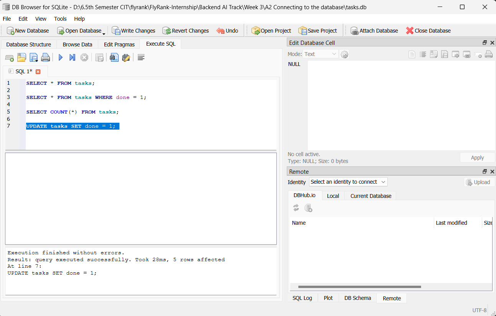

# Task API — SQLite CRUD

A FastAPI CRUD API for managing tasks, backed by a real SQLite database. Built as part of the Week 3 "Connecting your CRUD to the database" exercise (A2) — the direct sequel to Week 2's in-memory version, now with data that survives a restart.

## Database

This project uses **SQLite** for storage, chosen for a few reasons:

- **Single file** — the entire database is just one `tasks.db` file, no separate server process to run or manage.
- **Zero setup** — no install, no credentials, no connection string to configure; it works immediately.
- **Survives restarts** — data persists across server restarts, unlike an in-memory list or dict.

The database file, `tasks.db`, lives in the project root (alongside `server_crud.py`) and is created automatically the first time the app runs, along with the `tasks` table and three seeded example tasks (seeded only when the table is empty, so restarts never duplicate them). `tasks.db` is git-ignored, so each fresh clone of the repo starts from a clean slate.

## Quick Start

```bash
pip install "fastapi[standard]" && cd "./Backend AI Track/Week 3/A2 Connecting to the database/" && fastapi dev server_crud.py
```

Server runs at `http://127.0.0.1:8000`. Interactive Swagger docs are available at `http://127.0.0.1:8000/docs`. On first run, `tasks.db` is created automatically with the `tasks` table and three seeded tasks — no manual setup required.

## Endpoints

Same CRUD surface as Week 2 — only the storage layer changed, from an in-memory list to SQL queries against `tasks.db`.

| Method | Path          | Description                          | Success | Error(s)             |
|--------|---------------|---------------------------------------|---------|-----------------------|
| GET    | `/`           | API info (name, version, endpoints)  | 200     | —                     |
| GET    | `/health`     | Health check                          | 200     | —                     |
| GET    | `/tasks`      | List all tasks (`SELECT * FROM tasks`) | 200   | —                     |
| GET    | `/tasks/{id}` | Get one task by id (parameterized `WHERE id = ?`) | 200 | 404 (id not found) |
| POST   | `/tasks`      | Create a new task (`INSERT INTO tasks`) | 201  | 400 (missing/empty title) |
| PUT    | `/tasks/{id}` | Update a task's title and/or done (`UPDATE ... WHERE id = ?`) | 200 | 404, 400 (empty/invalid body) |
| DELETE | `/tasks/{id}` | Delete a task (`DELETE FROM tasks WHERE id = ?`) | 204 | 404 (id not found)   |

All writes use parameterized queries (`?` placeholders) — no user input is glued directly into SQL strings.

## Checkpoint — Full CRUD via curl

Example: create → update → confirm, now hitting `tasks.db` instead of memory.

```cmd
(fenv-flyrank) D:\...\A2 Connecting to the database>curl -i -X POST http://127.0.0.1:8000/tasks -H "Content-Type: application/json" -d "{\"title\":\"Go Exercise\"}"
HTTP/1.1 201 Created
date: Sat, 18 Jul 2026 13:04:30 GMT
server: uvicorn
content-length: 43
content-type: application/json

{"id":4,"title":"Go Exercise","done":false}
```

The rest of the CRUD lifecycle (update title, mark done, delete, and confirm with `GET /tasks`) was verified end-to-end, hitting every required status code: `201`, `200`, `204`, `404`, `400` — and re-verified after restarting the server, confirming the data persisted.

## Database Browser

The `tasks.db` file opened in DB Browser for SQLite, showing the `tasks` table populated from the checkpoint run:


## Example SQL Query (Stage 4)

One of the queries run by hand against `tasks.db` in DB Browser's "Execute SQL" tab, to confirm the API's writes landed correctly:

```sql
UPDATE tasks SET done = 1;
```

Running it marked every existing task as done, and the change showed up instantly through `GET /tasks` — no restart, no syncing, just one shared file.



## Repository

```bash
git clone https://github.com/LCoder-FILE/FlyRank-Internship
```
See: `FlyRank-Internship/Backend AI Track/Week 3/A2 Connecting to the database`