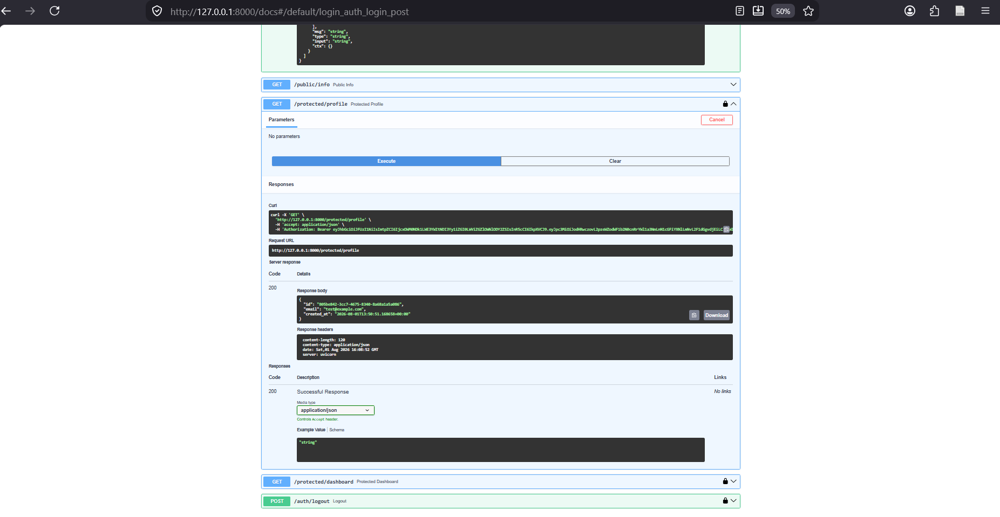

# Supabase Auth API

A small FastAPI service that wraps Supabase Auth: sign up, log in, log out,
one public route, and two token-protected routes guarded by a single
reusable dependency. Every protected route verifies the caller's token
against Supabase on every request — nothing is trusted based on the token's
contents alone.

## Run it

```bash
pip install -r requirements.txt
fastapi dev server_auth.py
```

API: `http://127.0.0.1:8000`
Interactive docs (with a working Authorize button): `http://127.0.0.1:8000/docs`

## Environment variables

Copy the example file and fill in your own Supabase project values:

```bash
cp .env.example .env
```

| Variable       | Description                                      | Example                                 |
|----------------|---------------------------------------------------|-------------------------------------------|
| `SUPABASE_URL` | Your Supabase project URL                          | `https://xxxxxxxxxxxx.supabase.co`       |
| `SUPABASE_KEY` | Project's Publishable (anon) key — **not** the secret/service_role key | `eyJhbGciOiJIUzI1NiIs...` |

See [`.env.example`](./.env.example) for the full template.

> **Never commit `.env`.** It's listed in `.gitignore` and was never pushed to
> this repo. Leaked Supabase keys get scraped by bots within minutes of
> hitting GitHub. If you ever suspect a key leaked, rotate it immediately in
> your Supabase dashboard.

## Endpoints

| Method | Path                  | Auth required            | Description                                              |
|--------|-----------------------|---------------------------|------------------------------------------------------------|
| POST   | `/auth/signup`        | No                        | Register with email + password, returns the new user      |
| POST   | `/auth/login`         | No                        | Exchange email + password for an access + refresh token    |
| GET    | `/public/info`        | No                        | Sample open route, no token needed                         |
| GET    | `/protected/profile`  | Yes — `Bearer <token>`    | Returns the verified caller's `id`, `email`, `created_at`  |
| GET    | `/protected/dashboard`| Yes — `Bearer <token>`    | Second protected route, reuses the same auth guard          |
| POST   | `/auth/logout`        | Yes — `Bearer <token>`    | Signs the current session out, returns `204 No Content`     |

Missing/invalid credentials return a JSON error body — `400` for a bad
signup/login payload, `401` for a missing or invalid/expired token — never a
silent failure.

## Example request

```bash
curl -i -X POST http://127.0.0.1:8000/auth/login \
  -H "Content-Type: application/json" \
  -d '{"email":"test@example.com","password":"password123"}'
```

```
HTTP/1.1 200 OK
content-type: application/json

{"access_token":"...","refresh_token":"..."}
```

Then use the token on a protected route:

```bash
curl -i http://127.0.0.1:8000/protected/profile \
  -H "Authorization: Bearer <ACCESS_TOKEN>"
```

```
HTTP/1.1 200 OK
content-type: application/json

{"id":"...","email":"test@example.com","created_at":"..."}
```

## Trying it in Swagger

`/docs` shows a lock icon on every protected route. Click **Authorize**,
paste a raw access token from `/auth/login` (no `Bearer ` prefix needed —
Swagger adds it), then **Try it out** on `GET /protected/profile` directly
from the browser.

**Screenshot:**



## Project history / stage log

See [`progress.md`](./progress.md) for the full step-by-step build log. In
short:

- **Stage 0** — FastAPI app wired up to a Supabase client, startup check
  confirms the connection.
- **Stage 1** — `POST /auth/signup` and `POST /auth/login`, both validating
  the request body server-side (never trusting the client) and calling
  Supabase's `sign_up()` / `sign_in_with_password()`.
- **Stage 2** — `GET /public/info` (open) and `GET /protected/profile`
  (rejects any request with no `Authorization: Bearer <token>` header, token
  not yet verified).
- **Stage 3** — `/protected/profile` now actually verifies the token against
  Supabase (`get_user()`), returning `401` on anything expired, tampered, or
  fake, and the caller's safe metadata on success.
- **Stage 4** — the token check was pulled out of the route body into a
  single reusable FastAPI dependency (`get_current_user`). `POST
  /auth/logout` and a second protected route (`/protected/dashboard`) were
  added using that same dependency, with zero new auth code.
- **Stage 5** — swapped manual header parsing for FastAPI's `HTTPBearer`
  security scheme, so Swagger UI automatically shows lock icons on every
  protected route and a working **Authorize** button.
- **Stage 6** — published to GitHub with secrets kept out of the repo (see
  below).