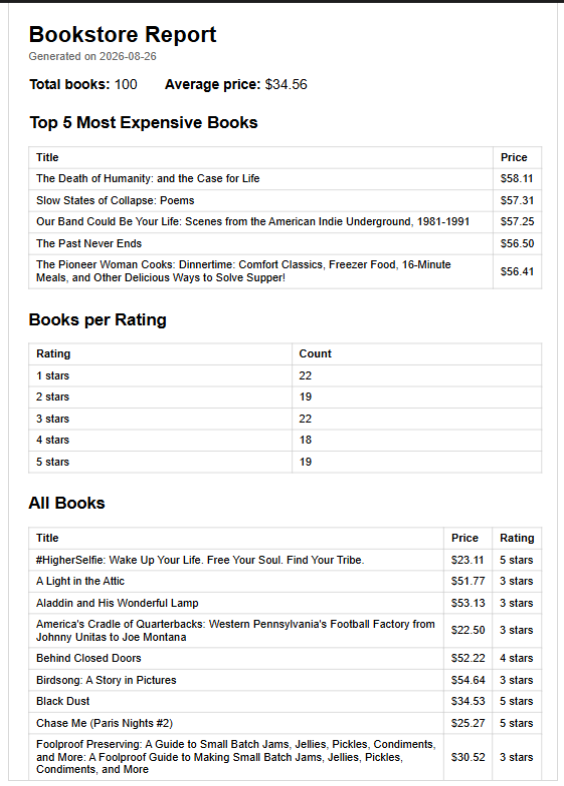

# PDF Report Generator

A small FastAPI service that queries a SQLite database of scraped books,
aggregates the data with SQL, renders it into a real PDF report using
Playwright, and serves the file by link. No background jobs — the whole
pipeline (query → render → store) runs inside a single request.

## Dataset

Bookstore — reuses book records scraped from books.toscrape.com (A9),
seeded into `report.db` (100 books).

## How to run

1. Install dependencies:
   ```
   pip install fastapi uvicorn playwright
   playwright install chromium
   ```
2. Seed the database:
   ```
   python seed.py
   ```
3. Start the API:
   ```
   fastapi dev server.py
   ```

> Note: if Playwright can't find Chromium (`Executable doesn't exist...`),
> re-run `playwright install chromium` in the same terminal you're using to
> run the server. If you relocated the browser install with
> `PLAYWRIGHT_BROWSERS_PATH`, make sure that variable is set in this
> terminal too before starting the server.

## Endpoints

| Method | Path | What it does |
|---|---|---|
| GET | `/health` | Health check |
| POST | `/reports` | Runs query → render → store; returns existing report from today (`200`) unless `{"force": true}`, otherwise generates a new one (`201`) |
| GET | `/reports/{id}` | Returns the report record; unknown id → `404` |
| GET | `/reports/{id}/file` | Downloads the PDF |

## Aggregation queries

```sql
-- Total books
SELECT COUNT(*) FROM books;

-- Average price
SELECT AVG(price) FROM books;

-- Top 5 most expensive books
SELECT title, price FROM books ORDER BY price DESC LIMIT 5;

-- Books per star rating
SELECT rating, COUNT(*) FROM books GROUP BY rating ORDER BY rating;
```

Sample output:

```json
{
  "total_books": 100,
  "average_price": 34.56,
  "top_5_expensive": [
    { "title": "The Death of Humanity: and the Case for Life", "price": 58.11 },
    { "title": "Slow States of Collapse: Poems", "price": 57.31 },
    { "title": "Our Band Could Be Your Life: Scenes from the American Indie Underground, 1981-1991", "price": 57.25 },
    { "title": "The Past Never Ends", "price": 56.5 },
    { "title": "The Pioneer Woman Cooks: Dinnertime: Comfort Classics, Freezer Food, 16-Minute Meals, and Other Delicious Ways to Solve Supper!", "price": 56.41 }
  ],
  "books_per_rating": [
    { "rating": 1, "count": 22 },
    { "rating": 2, "count": 19 },
    { "rating": 3, "count": 22 },
    { "rating": 4, "count": 18 },
    { "rating": 5, "count": 19 }
  ]
}
```

## Proof: generate + download

```
$ curl -i -X POST http://localhost:8000/reports
HTTP/1.1 201 Created
{"id":"a14d4a42-a068-418e-ba28-6ad561d0c4a9","file":"/reports/a14d4a42-a068-418e-ba28-6ad561d0c4a9/file"}

$ curl -o my-report.pdf http://localhost:8000/reports/a14d4a42-a068-418e-ba28-6ad561d0c4a9/file
[downloaded, opens as a real PDF]
```

## Duplicate requests (Stage 5)

Two rapid `POST /reports` calls on the same day return the **same id**, and
the second call is `200` instead of `201` — no second file is generated:

```
$ curl -i -X POST http://localhost:8000/reports
HTTP/1.1 200 OK
{"id":"daa4dde6-ca38-4fff-ac17-e6b4d095fa9c", ...}

$ curl -i -X POST http://localhost:8000/reports
HTTP/1.1 200 OK
{"id":"daa4dde6-ca38-4fff-ac17-e6b4d095fa9c", ...}
```

Sending `{"force": true}` bypasses the check and always generates a new report:

```
$ curl -i -X POST http://localhost:8000/reports -d '{"force": true}'
HTTP/1.1 201 Created
{"id":"de0c2a83-da9a-4236-b171-7d3ea7441a1c", ...}
```

## Notes

**Stage 4 — when would this move to a background job?**
> [your sentence here]

**Stage 5 — duplicate requests:**
1. What this check protects against:
   > Double-processing the same request.
2. Real-world example where a missing check like this costs money:
   > Calling the same paid API/service multiple times for the same work
   > wastes money for no extra value.

## Report preview

