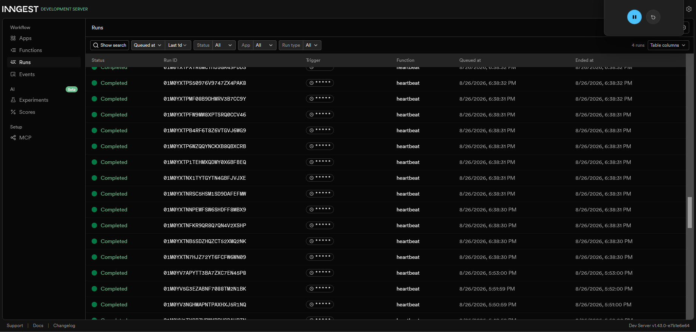

# Your First Background Job

A small FastAPI service that generates "reports" as a background job using
[Inngest](https://www.inngest.com), instead of blocking the request for 8
seconds. The API answers instantly, a status endpoint reports progress, and
one cron job runs on the clock alone.

## How to run

1. Install dependencies:
   ```
   pip install fastapi uvicorn inngest
   ```
2. **Terminal 1** — start the API:
   ```
   fastapi dev server.py
   ```
3. **Terminal 2** — start the Inngest Dev Server:
   ```
   npx inngest-cli@latest dev -u http://localhost:8000/api/inngest
   ```
4. Dashboard: http://localhost:8288

## Endpoints & functions

| Type | Name | Trigger | What it does |
|---|---|---|---|
| Endpoint | `GET /health` | HTTP request | Health check |
| Endpoint | `POST /reports` | HTTP request | Accepts a `topic`, returns `202` + id instantly |
| Endpoint | `GET /reports/{id}` | HTTP request | Returns report status: `pending` / `done`; `404` if unknown |
| Function | `say-hello` | event `test/hello` | Stage 1 test function — sleeps 5s |
| Function | `make-report` | event `report/requested` | Sleeps 8s, builds the report, marks it `done` |
| Function | `heartbeat` | cron `* * * * *` | Logs pending/done/failed counts every minute |

## Proof: 202 + poll

```
$ curl -i -X POST http://localhost:8000/reports -H "Content-Type: application/json" -d "{\"topic\":\"cats\"}"
HTTP/1.1 202 Accepted
date: Wed, 26 Aug 2026 08:22:28 GMT
server: uvicorn
content-length: 64
content-type: application/json

{"id":"20ada31b-3824-4c77-9b7a-cf749a8d716f","status":"pending"}
```

```
$ curl -i http://localhost:8000/reports/3c6a9feb-e341-48e0-bb17-85351ec959e9
HTTP/1.1 200 OK
date: Wed, 26 Aug 2026 08:57:57 GMT
server: uvicorn
content-length: 137
content-type: application/json

{"id":"3c6a9feb-e341-48e0-bb17-85351ec959e9","topic":"cats","status":"done","result":"Report on 'cats': here are 3 interesting facts..."}
```

The second response came back ~8 seconds after the first — the endpoint
answers immediately while `make-report` does the slow work in the background.

## Retries vs. validation (Stage 3)

Sending `topic: "fail"` causes `make-report` to throw. With `retries=2`
configured, Inngest retries the run automatically (attempt 1 → wait → attempt
2 → attempt 3 → **Failed**), with increasing backoff between attempts.

Sending no `topic` at all returns `400` instantly and never sends an event —
no job is ever created:

```
$ curl -i -X POST http://localhost:8000/reports -H "Content-Type: application/json" -d "{}"
HTTP/1.1 400 Bad Request
date: Wed, 26 Aug 2026 10:04:58 GMT
server: uvicorn
content-length: 30
content-type: application/json

{"detail":"topic is required"}
```

> Retries are for bad *moments* that could be the server's fault (a network
> hiccup, a transient failure) — worth trying again. Bad *input* isn't the
> server's fault, so it's rejected immediately instead of retried.

## Cron (Stage 4)

The `heartbeat` function runs every minute (`* * * * *`) and logs a summary
line, e.g.:

```
Heartbeat: pending=0, done=0, failed=0
```

Other schedules, built with [crontab.guru](https://crontab.guru):

- Every day at 08:00: `0 8 * * *`
- Every Sunday at 22:00: `0 22 * * 0`

## Dashboard



## Notes

- State (`reports` dict) is in-memory and resets on server restart — same
  trade-off as earlier assignments, not a bug.
- `is_production=False` is set on the Inngest client so the SDK talks to the
  local Dev Server instead of the Inngest cloud.